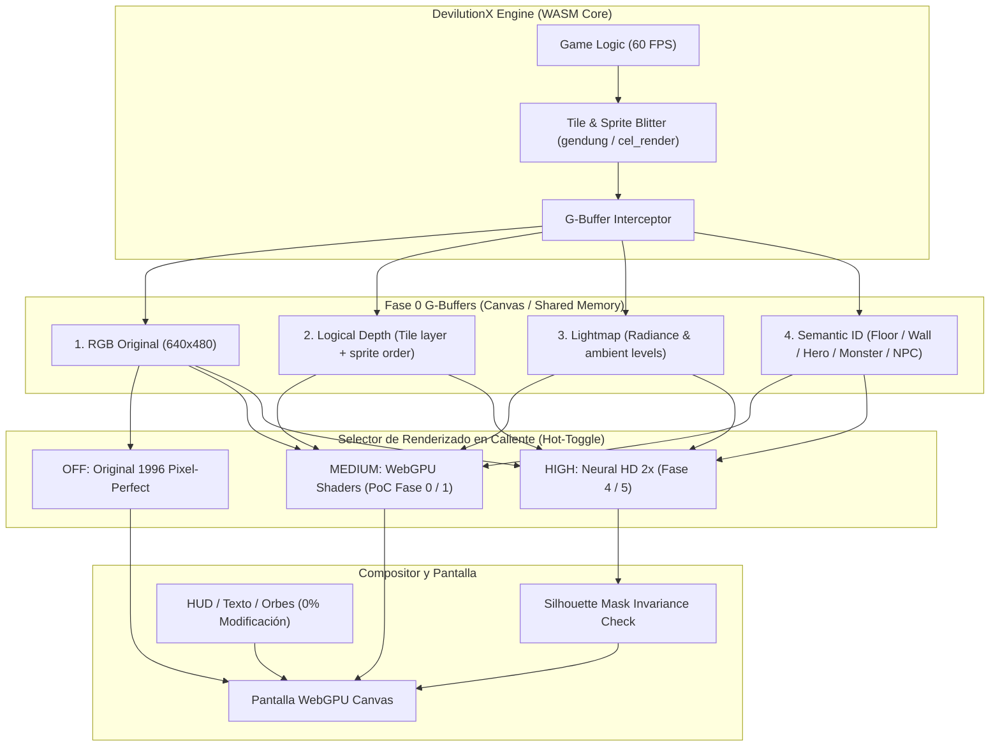

# NIGHTMARE Neural HD — Plan de Arquitectura e Implementación v2.0

> **Principio Rector**: *El motor (DevilutionX / WebAssembly) decide QUÉ existe. El renderer y los shaders deciden CÓMO se proyecta. La red neuronal optimiza la fidelidad visual sin alucinar ni inventar contenido.*
> 
> **Directiva de Inicio Inmediato**: **NO comenzar implementando el Neural Renderer.** Comenzar obligatoriamente por la **Fase 0 (Proof of Concept)** para validar la extracción de escena y sombreado WebGPU en Tristram con comparación A/B y métricas de frame-pacing antes de añadir complejidad neuronal o buffers secundarios.

---

## 1. Ajustes Arquitectónicos Clave (Feedback Integrado)

| Área | Enfoque Anterior | Enfoque Refinado (v2.0) | Beneficio Técnico |
| :--- | :--- | :--- | :--- |
| **Punto de Partida** | 6 buffers completos + pipeline neuronal simultáneo | **Fase 0 PoC**: Solo 4 buffers (`RGB`, `Depth` lógico, `Light`, `Semantic`) + WebGPU Shaders | Reduce el riesgo a cero; valida el canal de datos WASM $\leftrightarrow$ WebGPU en días, no semanas. |
| **Normal Mapping en 2.5D** | Asumir normal maps derivados de depth continuo | **Pseudo-normales**: Derivadas de `Depth` lógico + orientación isométrica de tiles + semántica + detección de bordes | Evita caer en la trampa de forzar geometría 3D continua donde hay tiles isométricos discretos de 1996. |
| **Control Anatómico** | Regla ética / estilística de diseño | **Restricción Técnica Dura**: Silhouette Constraint Mask ($S_{orig} \odot \text{Output}$) | Garantiza matemáticamente que la red no pueda desplazar contornos ni inventar anatomías o accesorios. |
| **Métrica #1 de Desempeño** | FPS promedio | **Frame Pacing & V-Sync Consistency** (e.g. 16.6ms constantes vs 60 FPS con stuttering) | La experiencia jugable de Diablo depende de la suavidad del frame pacing, no de picos aislados. |
| **Evolución de NPCs y Rostros** | Rostros tempranos como showcase | **Entorno $\rightarrow$ Siluetas $\rightarrow$ Shading $\rightarrow$ Rostros (al final)** | Previene la alucinación facial hasta que la base de materiales y luz sea perfecta. |

---

## 2. Flujo de Datos y Pipeline Técnico

---

## 3. Hoja de Ruta Gradual (Roadmap Definitivo)

### 🟢 FASE 0 — Proof of Concept: Tristram G-Buffer & WebGPU Shaders (CHECKPOINT 1)
- **Objetivo**: Demostrar que NIGHTMARE / DevilutionX en navegador puede exponer los 4 canales esenciales en tiempo real sin degradar el rendimiento:
  1. `RGB`: Frame original 640×480.
  2. `Depth`: Profundidad lógica normalizada (coordenadas de tile isométrico + orden $Z$ de sprites).
  3. `Light`: Mapa de iluminación original del motor (radio de antorchas, niveles de penumbra de Tristram).
  4. `Semantic`: Clasificación discreta básica:
     - `0`: Vacío / Sky
     - `1`: Suelo (hierba, caminos de tierra de Tristram)
     - `2`: Muros y techos de cabañas
     - `3`: Jugador
     - `4`: NPCs (Cain, Griswold, Pepin, etc.)
     - `5`: Agua / Río
     - `6`: Objetos interactivos (antorchas, fogata central, árboles)
- **Renderer**: Shader WebGPU en WGSL:
  - Pseudo-normales basadas en orientación isométrica y gradientes de borde.
  - Sombreado suave de la fogata de Tristram y antorchas.
  - Oclusión ambiental suave (*Contact Shadows*) en base a la máscara semántica de muros vs suelo.
- **Entregable de la Fase 0**: Selector interactivo A/B (**Original ↔ WebGPU Enhanced**) corriendo en el navegador con visor de frame-time en milisegundos.
- **Criterio de Aprobación para avanzar a Fase 1**: 60 FPS estables con frame-pacing consistente ($\sim 16.6\text{ms}$ por frame, $\Delta < 2\text{ms}$) en hardware estándar.

---

### 🟡 FASE 1 — WebGPU Native Renderer & Pseudo-Normal Pipeline
- Consolidación del backend WebGPU sin fallback dependiente del software blitter tradicional cuando esté activo.
- Refinamiento del cálculo de pseudo-normales para tiles isométricos y orientación de superficies.
- Respuesta diferencial de luz por tipo de semántica (el agua del río de Tristram refleja luz especular; la madera y paja absorben luz de forma difusa).

---

### 🟡 FASE 2 — Dataset Capture Mode Determinista
- Incorporación del flag `--dataset` o modo bot de captura en el build:
  - Generación de secuencias reproducibles mediante seeds de nivel fijas.
  - Volcado automático de tuplas: `(RGB, Depth, Light, Semantic)` + `Metadata JSON` (posiciones de fuentes de luz y entidades).
  - Cobertura inicial: **10.000 a 25.000 frames de Tristram** en diversas condiciones de iluminación y posiciones del jugador/NPCs.

---

### 🟡 FASE 3 — Teacher Renderer (Ground-Truth de Alta Fidelidad)
- Renderer WebGPU optimizado para calidad de referencia fuera de línea:
  - Cálculo de iluminación global aproximada en espacio de pantalla (Screen-Space Radiance).
  - Suavizado de bordes anti-aliased condicionado por la máscara semántica.
  - Generación de los targets supervisados de alta resolución ($2\times$) que la red aprenderá a aproximar rápidamente.

---

### 🟠 FASE 4 — Entrenamiento del Modelo Neural (Tiny Neural Renderer)
- **Arquitectura**: U-Net ultraligera / Multi-scale ConvNet optimizada para WebGPU (target peso $< 15\text{MB}$).
- **Restricción Dura de Silueta (Silhouette Invariance)**:
  $$\text{Loss} = \mathcal{L}_{pixel} + \lambda_{edge} \mathcal{L}_{edge} + \lambda_{consist} \mathcal{L}_{silhouette}$$
  Cualquier intento del modelo de extrapolar píxeles fuera de la silueta semántica original es fuertemente penalizado o recortado mediante máscara dura.
- **Exportación**: PyTorch $\rightarrow$ ONNX con cuantización FP16 adaptada al Execution Provider de WebGPU.

---

### 🟠 FASE 5 — Inferencia WebGPU en Navegador (`onnxruntime-web`)
- Integración en tiempo real en la página:
  - El buffer de escena se transfiere directamente a tensores WebGPU sin pasar por memoria CPU de JavaScript.
  - Ejecución del modelo a resolución $2\times$ (1280×960).
  - Blit final manteniendo el HUD original pixel-perfect superpuesto.
- **Sistema de Degradación Dinámica**:
  - Si el frame-time supera los $20\text{ms}$ de forma continuada, el motor degrada automáticamente de `HIGH (Neural)` a `MEDIUM (WebGPU Shaders)` o `LOW (WebGL)`.

---

### 🔴 FASE 6 — Expansión a Monstruos y Mazmorras
- **Monstruos**: Reconstrucción de bordes, antialiasing y sombreado sobre la silueta original de NIGHTMARE. No rediseño anatómico.
- **NPCs**: Rostros y expresiones faciales se abordan únicamente tras consolidar el sombreado corporal y del entorno.
- **Dungeon Progression**: Cathedral $\rightarrow$ Catacombs $\rightarrow$ Caves $\rightarrow$ Hell $\rightarrow$ Crypt $\rightarrow$ Hive.

---

## 4. Criterios de Evaluación y Calidad

1. **Métrica Primaria**: **Frame Pacing**. Cero tirones (frametime stutter). La desviación típica del tiempo de cuadro debe ser menor a $2.5\text{ms}$.
2. **Identidad Visual**: El resultado debe ser reconocible al 100% como Diablo 1 / NIGHTMARE 1996; ninguna silueta de sprite, arma o monstruo puede cambiar de forma.
3. **Legibilidad**: El HUD, orbes, texto del cursor y menús de inventario tienen un factor de distorsión del 0.0% (aislados del pass neuronal).
4. **Fallback Transparente**: El juego debe ser completamente jugable en cualquier equipo antiguo mediante el modo `OFF (Original)` o `LOW (WebGL)`.

---

## 5. Próximo Paso Inmediato (Ejecución de Fase 0)

1. **Inspección de Puntos de Enganche en DevilutionX**:
   Identificar en los archivos de renderizado (`Source/engine.cpp`, `Source/gendung.cpp`, `Source/cel_render.cpp`) dónde se componen los tiles de Tristram y sprites de NPCs para interceptar las llamadas y extraer:
   - Buffer `RGB` nativo.
   - Profundidad lógica (`Depth`).
   - Mapa de luz (`Light`).
   - Identificador de clase (`Semantic ID`).
2. **Configuración del Harness WebGPU**:
   Montar el pipeline en WGSL con el selector A/B para la escena inicial de Tristram sin descargar dependencias pesadas innecesarias.
